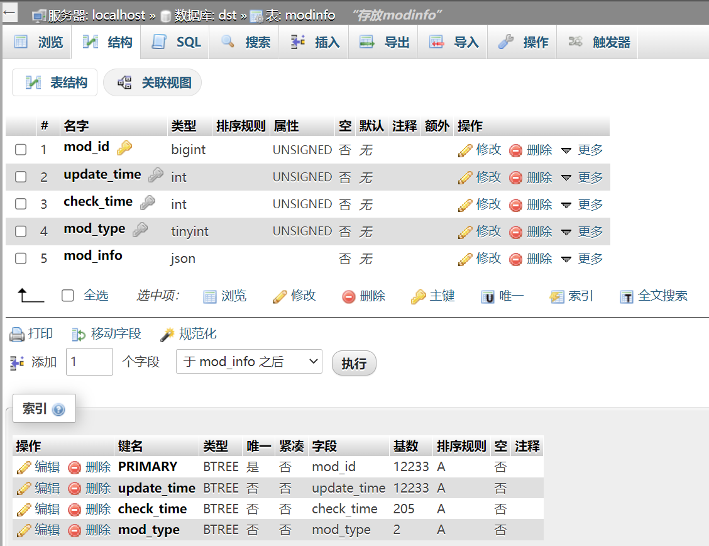
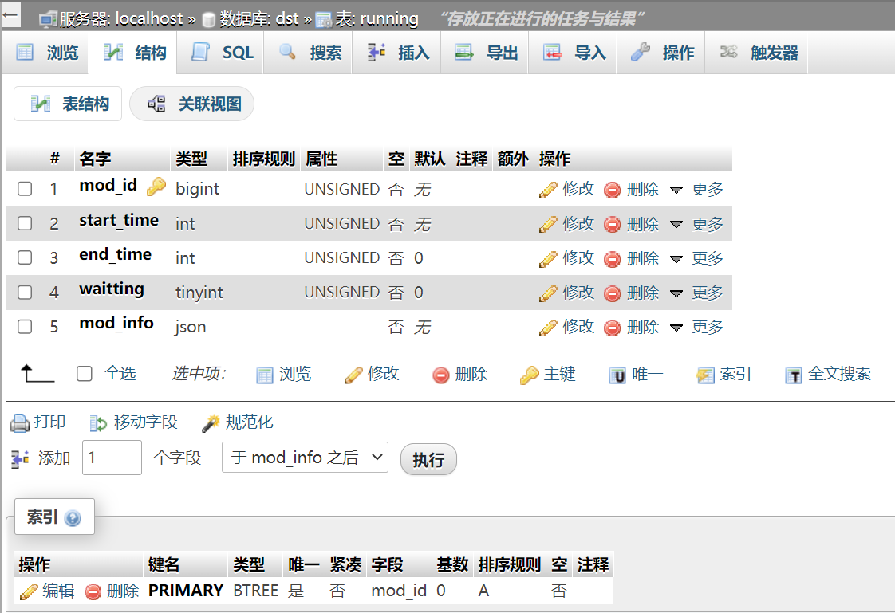

# 此版本仅是 demo，存在很多问题
尚有很多不足，不建议尝试。如果想运行，需要做一些准备工作
## 安装 nginx
添加 dst.html（前端网页）的路由规则

将 /tools/ 的请求访问转发到 127.0.0.1:55555（后端功能）
示例：
```
location ~/tools/ {
  include      uwsgi_params;
  uwsgi_pass   127.0.0.1:55555;  # 指向uwsgi,所有请求将转发给uwsgi 处理
  uwsgi_param UWSGI_PYHOME /www/wwwroot/dst.duke.fun/venv; # 指向虚拟环境目录
  uwsgi_param UWSGI_CHDIR  /www/wwwroot/dst.suke.fun; # 指向网站根目录
  uwsgi_param UWSGI_SCRIPT app; # 指定启动程序
}
```
## 安装 mysql8.0
创建名为 dst 的库，并添加 modinfo、running 两个表，结构如下：
modinfo：

running：


按照你的环境修改 ./venv/mysql_login.cnf 文件中的设置项
## 开启后端服务
按照你的环境修改 ./venv/config.ini 内参数（主要指 chdir 项）

运行指令通过uwsgi
```shell
cd ./venv && ./start.sh
```
## 其它注意事项
### 其他配置文件
./venv 路径下还有几个配置文件，steamapikey.txt、pyvenv.cfg，需要按照你当前的环境正确修改
### 世界设置所需文件
世界设置的资源文件还没有写自动处理的功能，目前还是手动更新，包括三个文件：
+ ./misc/dst_world_setting.json
+ ./misc/worldsettings_customization.webp
+ ./misc/worldgen_customization.webp

在饥荒添加新的配置项后，需要调用 steamapi.py 中 download_dst_scripts 函数，获取新的游戏文件，再通过 parse_worldsetting.py 生成 dst_world_setting.json

在 ./venv/data/images 路径下，找到 worldsettings_customization.tex、worldgen_customization.tex 文件，将格式转为 webp，得到剩下两个文件

将三个文件移动到 ./misc 路径下

## 应该是 OK 了